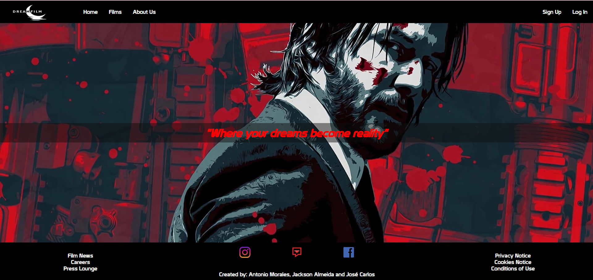
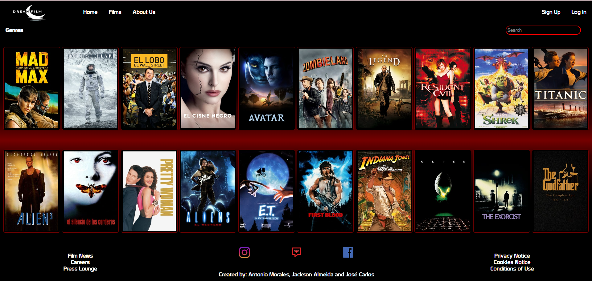
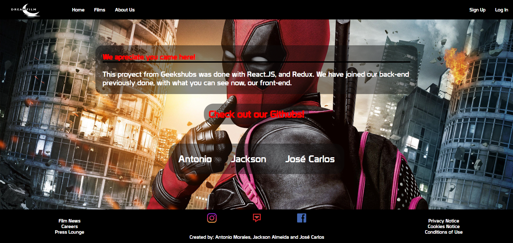
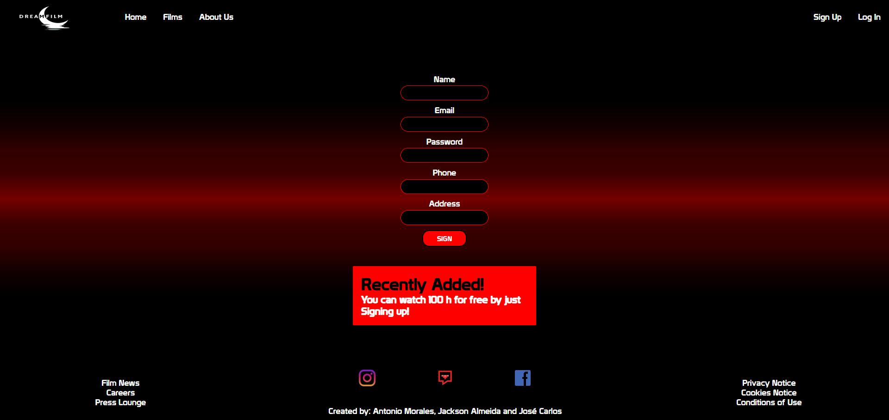
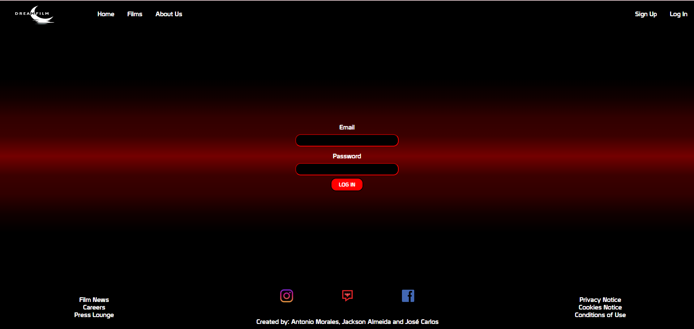
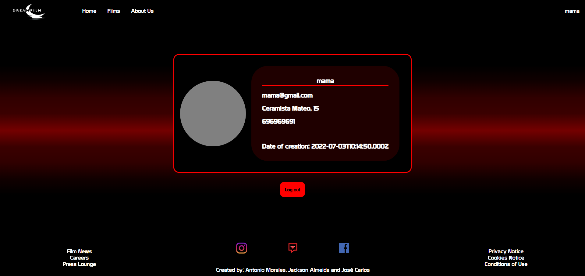

|    |     |      |
|:--:|:--:|:--:|

<h1 align="center">🎞️​ Dreamfilm 🎞️​​</h1>

<h1 align="center"></h1>
<h3 align="center"><em style="color: #ba932f" >Created by: Jackson Almeida, Antonio Morales and José Carlos Núñez</em></h3>

<h2>🚩​​ Intro</h2>

  <a href="">Description</a> 
    
  <a href="">Pages</a> 
   
  <a href="">Extras</a>
   
  <a href="">Improvements</a>

<h2>📝​ Description</h2>
 

***Dreamfilm*** Its a fullstack project... in more detail, its an entertaiment plataform simulated in which you could "watch" what film we have available and see them.

 

<h2>❓​ Pages</h2>

| Page | Screenshoot |
|:-----:|:----:|
| Home |  |
| Film |  |
| About us |  |
| Sign up |  |
| Log in |  |
| Profile |  |

<h2>🛡️​​ Extras</h2>
 
* Multiple fields are <strong>regulated</strong>.
 
* We added that you can see more  <strong>detailed information about every movie</strong>.

<h2>😭 Improvements</h2>
- We wished that we added more into this project.
 
<em>for example, being able to purchase any movie*</em>
 

 
<h2>​🤟​🖖​🖐️​</h2>
<h2>Thank you for visiting!</h2>
